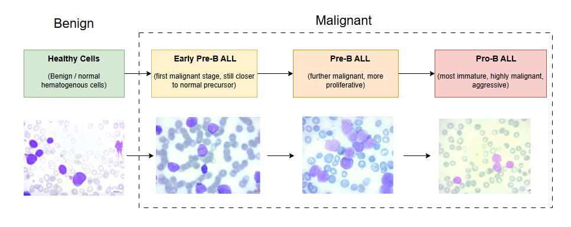

# B-ALL Classification with Deep Learning
**Author:** Shimaa Abu Youcef
## Overview

This project implements a deep learning system for classifying B-cell Acute Lymphoblastic Leukemia (B-ALL) subtypes from peripheral blood smear images using PyTorch and DenseNet-121 architecture.



**Author:** Shimaa Abu Youcef

## Classification Targets

The system classifies blood cell images into four categories:
- **Early Pre-B ALL** - Early stage B-cell acute lymphoblastic leukemia
- **Pre-B ALL** - Pre-B cell acute lymphoblastic leukemia  
- **Pro-B ALL** - Pro-B cell acute lymphoblastic leukemia
- **Benign** - Normal, healthy blood cells
## Clinical Significance

Accurate classification of leukemia subtypes is important for:
- Treatment planning based on subtype-specific protocols
- Prognosis assessment and outcome prediction
- Supporting diagnostic workflows in medical settings

## Technical Features

- **Architecture**: DenseNet-121 with transfer learning
- **Preprocessing**: CLAHE (Contrast Limited Adaptive Histogram Equalization)
- **Framework**: PyTorch with comprehensive training pipeline
- **Visualization**: Grad-CAM for model interpretability
- **Evaluation**: Confusion matrices, classification reports, training curves

## Project Structure

```
LEUK/
├── main.ipynb              # Main training implementation notebook
├── inference.ipynb         # Model inference examples and usage
├── app.py                  # Streamlit web application
├── requirements.txt        # Python dependencies
├── run_app.bat            # Windows batch file to run Streamlit app
├── README.md              # Project documentation (this file)
├── APP_README.md          # Streamlit app documentation
├── data.png               # Dataset sample visualization
├── models/                # Trained model directory
│   └── leukeai_densenet121.pth  # Trained DenseNet-121 model weights
├── test_sample/           # Sample images for testing
│   ├── Snap_001.jpg       # Test image 1
│   ├── Snap_002.jpg       # Test image 2
│   └── Snap_003.jpg       # Test image 3
└── 
```

### File Descriptions

- **`main.ipynb`**: Complete training pipeline with data preprocessing, model training, evaluation, and visualization
- **`inference.ipynb`**: Demonstrates how to load the trained model and make predictions on new images
- **`app.py`**: Interactive Streamlit web application for easy B-ALL classification with file upload interface
- **`requirements.txt`**: All Python dependencies needed to run the project
- **`run_app.bat`**: Convenient script to launch the Streamlit app on Windows
- **`models/`**: Directory containing the trained model weights file
- **`test_sample/`**: Sample blood cell images for testing the model and app
- **`APP_README.md`**: Detailed documentation specifically for the web application

## Machine Learning Pipeline

### Data Preparation
- **Preprocessing**: CLAHE enhancement in LAB color space
- **Data Splitting**: 90% training, 10% testing (stratified)
- **Augmentation**: Random flips, rotations, color jittering
- **Normalization**: ImageNet statistics for transfer learning

### Model Architecture
- **Base Model**: DenseNet-121 (ImageNet pretrained)
- **Custom Classifier**: Fully connected layer for 4-class classification
- **Input Size**: 224×224×3 RGB images
- **Output**: Softmax probabilities for [Benign, Early Pre-B, Pre-B, Pro-B]

### Training Configuration
- **Optimizer**: Adam (lr=1e-4, weight_decay=1e-5)
- **Scheduler**: StepLR with step_size=7, gamma=0.1
- **Loss Function**: CrossEntropyLoss
- **Early Stopping**: Patience=5 epochs
- **Batch Size**: 32

### Evaluation and Visualization
- **Metrics**: Confusion matrix, classification report, per-class statistics
- **Training Monitoring**: Loss and accuracy curves
- **Explainability**: Grad-CAM heatmaps for model interpretation

## Installation and Setup

### Requirements
```
Python 3.8+
PyTorch 2.x + torchvision
OpenCV (cv2)
scikit-learn
matplotlib + seaborn
tqdm
imutils
PIL (Pillow)
```

### Setup Instructions
1. **Clone or download the project**
2. **Install dependencies**
   ```bash
   pip install torch torchvision
   pip install opencv-python scikit-learn
   pip install matplotlib seaborn tqdm
   pip install imutils pillow
   ```
3. **Prepare dataset**
   - Place blood cell images in the required directory structure
   - Ensure images are in PNG, JPG, or JPEG format
4. **Run the notebook**
   ```bash
   jupyter notebook main.ipynb
   ```

## Usage

The main implementation is contained in `main.ipynb`. Execute the cells sequentially to:

1. **Load and preprocess data** with CLAHE enhancement
2. **Create train/test splits** with stratification
3. **Initialize DenseNet-121 model** with custom classifier
4. **Train the model** with early stopping and learning rate scheduling
5. **Evaluate performance** with metrics and visualizations
6. **Generate Grad-CAM visualizations** for model interpretability

### Example Code Snippets

**Load and preprocess data:**
```python
train_dataset = LeukemiaDataset(train_list, transform=train_transforms, mode="clahe")
test_dataset = LeukemiaDataset(test_list, transform=test_transforms, mode="clahe")
```

**Initialize model:**
```python
model = models.densenet121(pretrained=True)
model.classifier = nn.Linear(model.classifier.in_features, 4)
```

**Generate Grad-CAM visualization:**
```python
gradcam = GradCAM(model, target_layer="features.denseblock4")
cam = gradcam.generate(input_tensor)
```

## Results and Performance

The model achieves competitive performance on B-ALL classification with:
- Validation accuracy in the 90-95% range
- Efficient preprocessing with CLAHE enhancement
- Interpretable predictions through Grad-CAM visualization
- Robust training with early stopping and learning rate scheduling

## Dataset Requirements

- **Image Type**: RGB microscopy images of blood smears
- **Resolution**: Automatically resized to 224×224 pixels
- **Format**: PNG, JPG, or JPEG
- **Classes**: Four categories (Benign, Early Pre-B, Pre-B, Pro-B)

## Key Design Decisions

**CLAHE Preprocessing**: Selected CLAHE-only preprocessing over complex segmentation methods for:
- Faster processing time
- More stable results across different image qualities
- Preservation of diagnostic features
- Better suitability for practical deployment

**DenseNet-121 Architecture**: Chosen for its effective feature extraction capabilities and proven performance on medical imaging tasks.

## Contributing

Contributions are welcome. Please:
1. Fork the repository
2. Create a feature branch
3. Commit changes with clear messages
4. Submit a pull request

## License

This project is licensed under the MIT License.

## Contact

**Author:** Shimaa Abu Youcef

---

*This project is for research and educational purposes. Medical diagnosis should always involve qualified healthcare professionals.*
